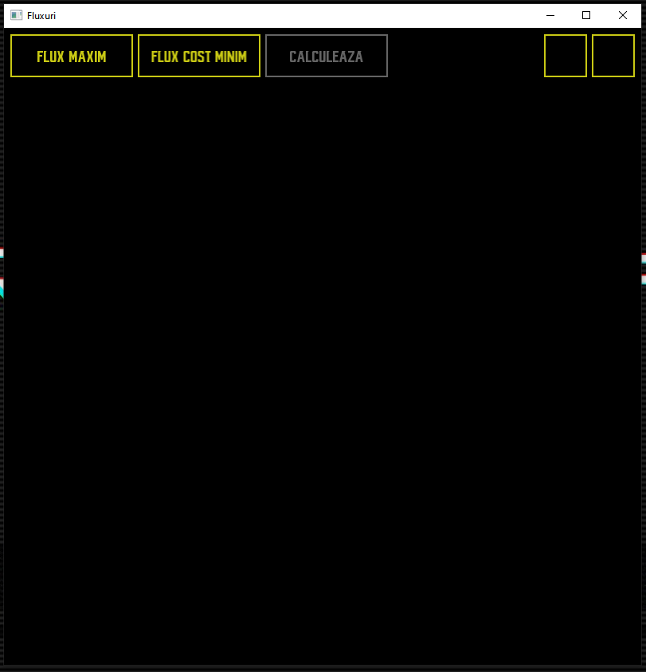
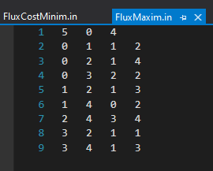
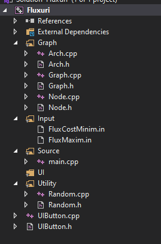

## (3/3) Flow network

### Description
In this project we had to implement the minimum and maximum value flow network graph algorithms. The algorithms I've implemented also determine and display the minimal cut, the flow optimization points and other auxiliary information.

### Visualizer (User Interface)
The user has the possibility to load a specific graph, by pressing one of the two buttons on the left top corner of the window. After choosing a graph, the selected graph will be loaded and rendered and the user will have the possibility to apply the selected algorithm, by pressing the 3rd button. After that, the algorithm will be applied and the results will be displayed accordingly.
|||
|:-:|:-:|
|||
|||

### Input Data
The input data consists of adjacency lists in which every detail needed for each algorithm are given (such as: number of nodes, source node, destination node, arcs, arc flows, arc flow capacities, etc.)
 
 

### Project Structure
|Structure|Details|
|:-|:-|
||- **Graph**: Declarations and definitions of the classes used for graph theory logic and algorithms - **Input**: Static resources (input files) - **Utility**: Utility classes used for different purposes (such as the rapidxml library, used for reading and parsing the XML files) - **Source**: Source/launch (main function) - **UI**: UI components used (such as UIButton)|
