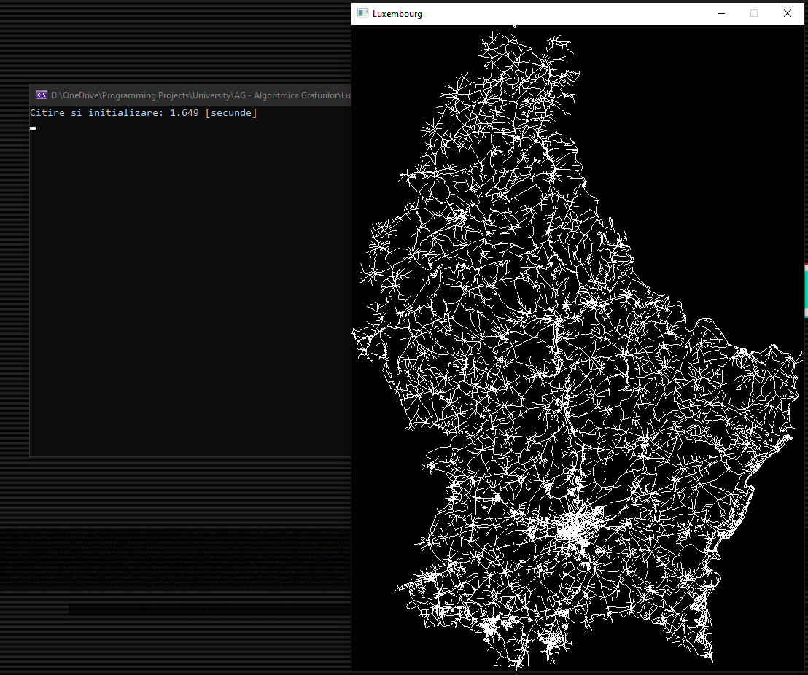
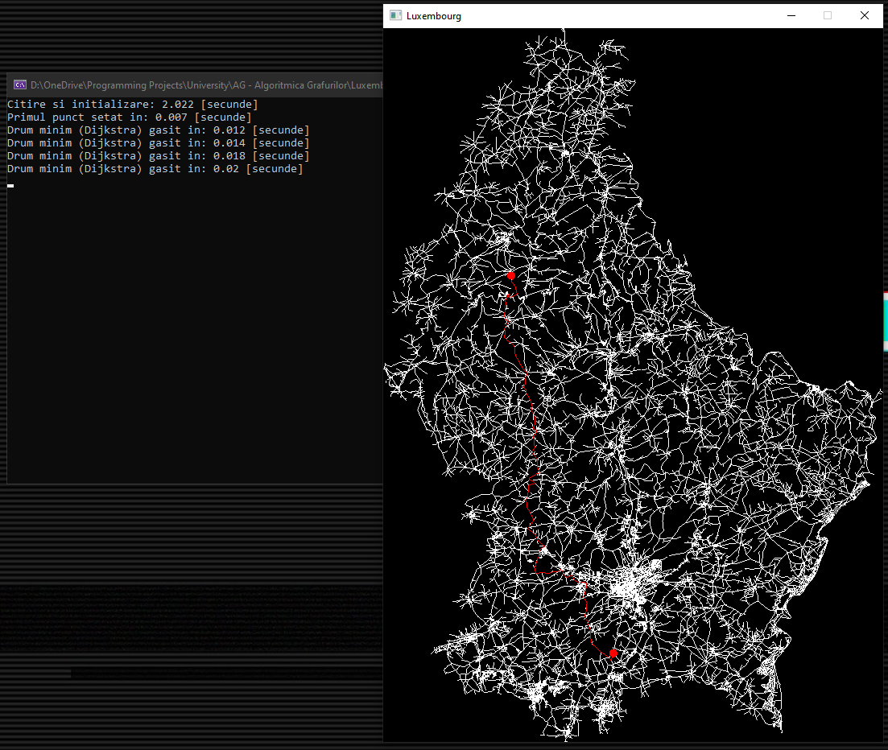
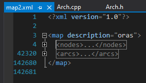
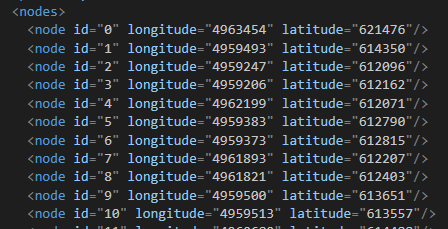
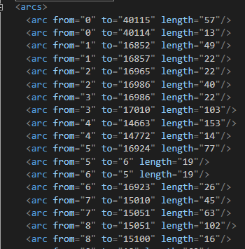
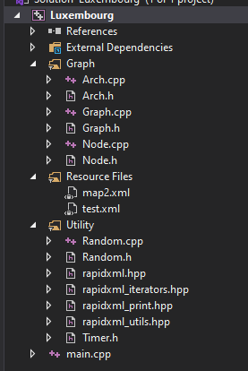

## (2/3) Luxembourg

### Description
In this project we had to use a path detection algorithm (I used A*), in order to find the shortest available path between two selected points on a Luxembourg map loaded and rendered accordingly (from XML read nodes and vertices)

### Visualizer (User Interface)
The user has the possibility to select two points on the map, and the shortest path will pe displayed as soon as the second point is selected and the calculations are finished. Map rendering, points determination and path finding times are displayed in the console window.
|||
|:-:|:-:|

### Input Data
The input data consists of a XML file, containing all the nodes and arcs (vertices) of a given map (Luxembourg in this case), and their corresponding details:
 
|||
|:-:|:-:|

### Project Structure
|Structure|Details|
|:-|:-|
||- **Graph**: Declarations and definitions of the classes used for graph theory logic and algorithms - **Resource files**: Static resources (xml maps) - **Utility**: Utility classes used for different purposes (such as the rapidxml library, used for reading and parsing the XML files)|
