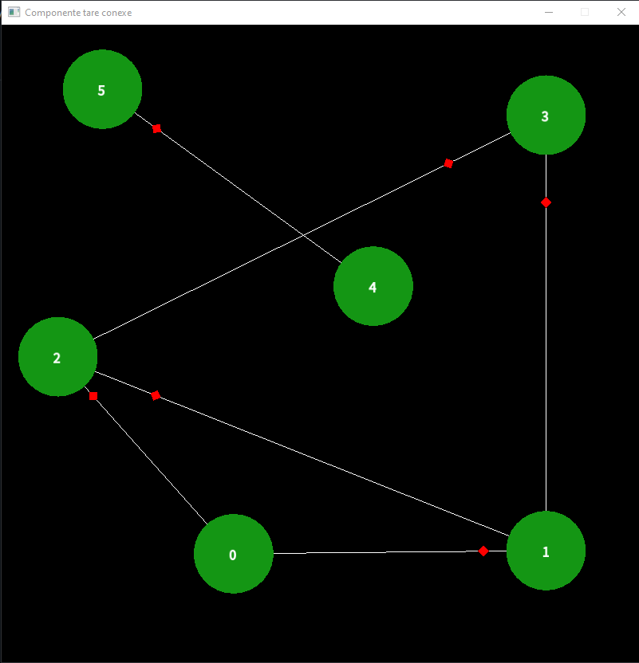

 

# General Presentation
This repository represents the work I've done for the Graph Theory Algorithms laboratories, in 2019, at Transylvania University of Brașov, Romania.

## Purpose
In order to pass this laboratory, we had to do 3 projects. Each project consisted of implementations of graph theory algorithms learned at class, adding visualizers to each of them:
1. **[General graph algorithms](Algoritmica%20Grafurilor%20App)**: In this project we had to implement different general graph theory algorithms, such as: a general graph representation, solving a labyrinth, topological sort, connected & strongly connected components, etc.
2. **[Luxembourg](Luxembourg)**: In this project we had to use a path detection algorithm, in order to find the shortest available path between two selected points on a Luxembourg map loaded and rendered accordingly (from read nodes and vertices)
3. **[Flow network](Fluxuri)**: In this project we had to implement the minimum and maximum value flow network graph algorithms

## Visualizers showcase

Some of the visualizers are displayed below:

| Labyrinth| Luxembourg|
|:-:|:-:|
| **Flow network**| **Strongly connected components**|

## Technologies and dependencies
For the implementation of these projects I've used the following technologies and dependencies:
- **Visual Studio**: IDE
- **C++**: Programming language
- **[SFML](https://www.sfml-dev.org/index.php)**: A lightweight multi-media C++ library used for fast rendering, visual programming and media management
- **[RapidXML](http://rapidxml.sourceforge.net/)**: A lightweight XML C++ library used for reading and parsing XML files

   

# Projects

## (1/3) General graph algorithms
> Location: [1/3 General graph algorithms](Algoritmica%20Grafurilor%20App)

### Description
In this project we had to implement different general graph theory algorithms. The project consists of 4 parts as follows:
1. General graph representation read from an adjacency list
2. Solving a labyrinth by determining the exit points, sorting them by distance and the finding the shortest path to them using A* algorithm
3. Determining the topological sort (order + graph), connected components & strongly connected components
4. Determining the minimum spanning tree

### Visualizers (User Interface)
The user has the possibility to select one of the 4 visualizers from the console window, corresponding to the 4 parts described above:
 
 
The visualizers are as follows:
1. General graph representation
 
2. Labyrinth

|||
|:-:|:-:|

3. Topo, CC, SCC

|||
|:-:|:-:|
4. MST
 

### Input Data
The input data for each part is as follows:
1. An adjacency list (where each line represents the connections a node has and @ represents no connections for the specific node)
 
2. A matrix with a given size, representing the labyrinth's structure. (0 = wall; 1 = free; 2 = source)
 
3. An adjacency list (same as pt. 1)
 
4. An adjacency matrix (where matrix[i][j] position represents the weight of the arc that goes from node i to node j, or -1 if no such arc exists)
 

### Project Structure
|Structure|Details|
|:-|:-|
||- **Header files**: Declarations of used classes - **Resource files**: Static resources, mostly input files - **Source Files**: Definitions of the prior declared classes|

## (2/3) Luxembourg
> Location: [2/3 Luxembourg](Luxembourg)

### Description
In this project we had to use a path detection algorithm (I used A*), in order to find the shortest available path between two selected points on a Luxembourg map loaded and rendered accordingly (from XML read nodes and vertices)

### Visualizer (User Interface)
The user has the possibility to select two points on the map, and the shortest path will pe displayed as soon as the second point is selected and the calculations are finished. Map rendering, points determination and path finding times are displayed in the console window.
|||
|:-:|:-:|

### Input Data
The input data consists of a XML file, containing all the nodes and arcs (vertices) of a given map (Luxembourg in this case), and their corresponding details:
 
|||
|:-:|:-:|

### Project Structure
|Structure|Details|
|:-|:-|
||- **Graph**: Declarations and definitions of the classes used for graph theory logic and algorithms - **Resource files**: Static resources (xml maps) - **Utility**: Utility classes used for different purposes (such as the rapidxml library, used for reading and parsing the XML files)|

## (3/3) Flow network
> Location: [3/3 Flow network](Fluxuri)

### Description
In this project we had to implement the minimum and maximum value flow network graph algorithms. The algorithms I've implemented also determine and display the minimal cut, the flow optimization points and other auxiliary information.

### Visualizer (User Interface)
The user has the possibility to load a specific graph, by pressing one of the two buttons on the left top corner of the window. After choosing a graph, the selected graph will be loaded and rendered and the user will have the possibility to apply the selected algorithm, by pressing the 3rd button. After that, the algorithm will be applied and the results will be displayed accordingly.
|||
|:-:|:-:|
|||
|||

### Input Data
The input data consists of adjacency lists in which every detail needed for each algorithm are given (such as: number of nodes, source node, destination node, arcs, arc flows, arc flow capacities, etc.)
 
 

### Project Structure
|Structure|Details|
|:-|:-|
||- **Graph**: Declarations and definitions of the classes used for graph theory logic and algorithms - **Input**: Static resources (input files) - **Utility**: Utility classes used for different purposes (such as the rapidxml library, used for reading and parsing the XML files) - **Source**: Source/launch (main function) - **UI**: UI components used (such as UIButton)|
